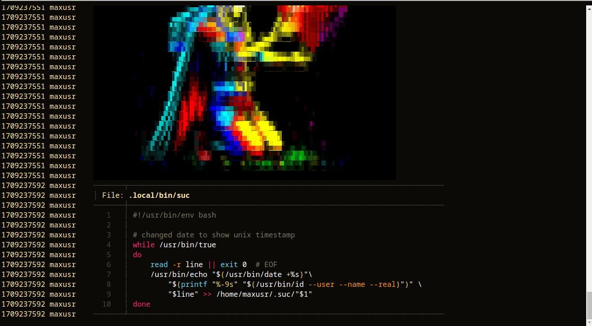

## suc on the web (Simple Unix Chat)

years using the bash command line everyday on my system
i have got interested in all things UNIX and their KISS
philosophy "Keep It Simple Stupid" or "Keep it Stupidly Simple" 
i came across this neat BASH script with the title

[A slack clone in 5 lines of bash](https://the-dam.org/docs/explanations/suc.html)

i love how simple and elegant this solution is, keeping one file
as the message channel, and reading out the message history is
easy.. choose your preferred tools, 
i use `tail -f .suc/channel` to print out the updated history
and bash even shown ANSI colors and "images" converted with
tools like TIMG

another tool for the web is `websocketd` that adheres to the UNIX 
style being a single binary that transmits any info piped to it through
STDIN, like `websocketd --port 8888 tail -f .suc/channel` and so is
readable on `ws://localhost:8888`
this way the updated message stream is available to be read on a
website with a little-to minimal javascript, 

suc_channel.html is my little implementation of this, its very basic
and i used a html template i worked on for another project because i 
liked the color layout, 

screenshot of how it looks inside a <pre> element processed with ansi_up.js

sources
- http://github.com/drudru/ansi_up
- https://the-dam.org/docs/explanations/suc.html
- http://websocketd.com/